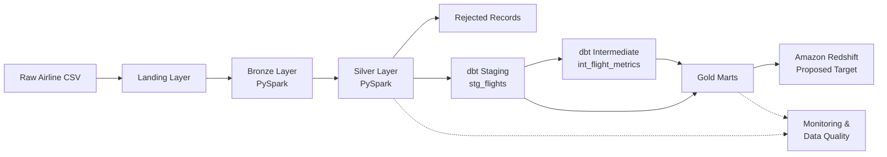

# Airline Data Pipeline Architecture

## Overview

The pipeline follows a Medallion Architecture that separates raw ingestion, data cleaning, and analytical modeling.



## Data Flow

### 1. Landing

The source airline flight-pricing CSV is placed in the landing area.

```text
data/landing/
```

This represents the incoming source data before transformation.

### 2. Bronze

PySpark reads the source file and preserves the raw source values.

The Bronze layer:

* Reads the source CSV
* Disables schema inference
* Preserves source fields as strings
* Adds source-file metadata
* Adds ingestion timestamp
* Adds pipeline run ID
* Stores the original row as a JSON payload

Bronze data is stored as Parquet.

```text
data/bronze/flights/
```

### 3. Silver

The Silver layer uses PySpark to create clean and validated records.

The transformation performs:

* Whitespace trimming
* Data type conversion
* Business-rule validation
* Invalid-record rejection
* Duplicate detection
* Deduplication

Valid records are stored in:

```text
data/silver/flights/
```

Rejected records are stored separately:

```text
data/silver/rejected_flights/
```

### 4. dbt Staging

The dbt staging model reads the Silver Parquet data.

Model:

```text
stg_flights
```

The staging layer standardizes field names and provides the foundation for analytical transformations.

### 5. dbt Intermediate

The intermediate model provides reusable aggregated flight metrics.

Model:

```text
int_flight_metrics
```

It calculates metrics such as:

* Flight count
* Average price
* Average duration
* Average days left
* Minimum price
* Maximum price

### 6. Gold

The Gold layer contains business-focused analytical datasets.

The project contains three Gold marts:

```text
mart_airline_performance
mart_route_performance
mart_pricing_lead_time
```

These datasets are designed for repeated analytical queries.

### 7. Amazon Redshift

Amazon Redshift is the proposed production warehouse target.

The target DDL is located at:

```text
redshift/schema.sql
```

The current project uses DuckDB for local dbt development and validation, so an active Redshift cluster is not required.

## Architecture Principles

The architecture is designed around:

* Separation of raw and transformed data
* Data traceability
* Explicit data-quality validation
* Reusable transformation logic
* Business-focused analytical models
* Safe incremental processing
* Reconciliation between pipeline layers
* Production observability
